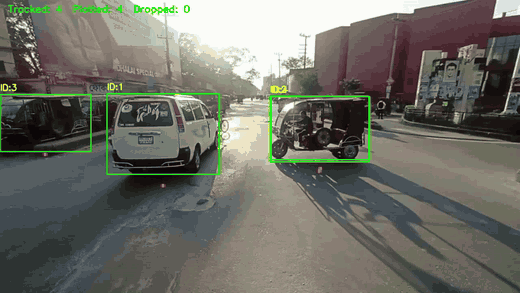
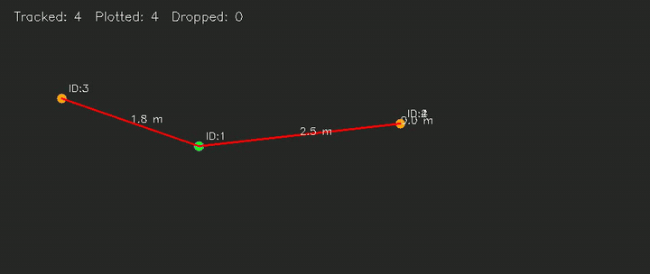
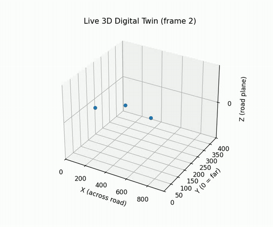

# URBAN DIGITAL TWIN PERCEPTION ENGINE

### TalkToMyTwin: a conversational traffic digital twin built from a single roadside camera

TalkToMyTwin turns ordinary traffic footage into a live, metric, bird's-eye model of the road. Every vehicle is detected, tracked, projected onto the ground plane, and logged with its position over time. On top of that log sit analytics and safety measures such as speed, lane usage, headway and time-to-collision. A conversational layer that explains what the twin sees is planned.

---

## Demo

One pass of `digital_twin_log.py` over a clip produces three synchronized views plus a per-detection CSV log.

**Source tracking:** YOLO detections, persistent track IDs, and the estimated ground-contact point of each vehicle.

<p align="center"></p>

**Digital twin (2D bird's-eye):** each vehicle is a point on the road plane in meters, with heading arrows and proximity lines between nearby vehicles. Green points are near-field (high position confidence) and orange points are far-field.

<p align="center"></p>

**Digital twin (3D):** the same scene on a single ground plane, colored by vehicle class.

<p align="center"></p>

---

## Current Progress

| Stage | Status | Where |
| --- | --- | --- |
| Road segmentation (SegFormer, Cityscapes) | Done | `road_seg.py` |
| Automatic calibration frame selection | Done | `best_frame.py` |
| Automatic homography / IPM from fitted road edges | Done | `homo_IPM.py` |
| Vehicle detection + multi-object tracking (YOLO11s + BoT-SORT) | Done | `digital_twin_log.py` |
| Ground-point refinement, smoothing, jump rejection | Done | `digital_twin_log.py` |
| Live 2D + 3D twin with video recording | Done | `digital_twin_log.py` |
| Per-detection CSV logging | Done | `tracking_log.csv` |
| Kalman filter kinematics (position, velocity, acceleration) | Done | `kalman.py`, `motion.py` |
| Tracking quality evaluation | Done | `eval.py` |
| Traffic EDA (lanes, speed, headway, Edie's fundamental diagram) | Done | `eda.py` |
| Surrogate safety measures (TTC, MTTC, DRAC) | Done (offline) | `ttc.py` |
| MOT-format export for TrackEval | Done | `trackeval_export.py` |
| Ground-truth annotation + HOTA/MOTA scoring | In progress | |
| Real-time alert engine | Planned | |
| Multi-camera fusion (other intersection approaches) | Planned | |
| Conversational interface (LLM explains twin state) | Planned | |

---

## Pipeline

```text
Camera feed
    -> Road segmentation (SegFormer)          road_seg.py
    -> Calibration frame + homography         best_frame.py, homo_IPM.py
    -> Detection + tracking (YOLO11s, BoT-SORT)
    -> Ground-point projection to road plane   digital_twin_log.py
    -> 2D / 3D twin + tracking_log.csv
    -> Kalman kinematics                       kalman.py, motion.py
    -> Evaluation, EDA, safety measures        eval.py, eda.py, ttc.py
```

**Calibration.** `best_frame.py` scans the clip for the frame with the largest visible road area. `homo_IPM.py` fits straight lines to the left and right road edges of that frame's mask, takes four corners from them, and maps them to a rectangle that assumes a 7 m road width at 120 px/m. The resulting matrix is saved to `homography.npy`.

**Twin.** Each tracked box is reduced to a ground-contact point, refined from the dark band under the vehicle. That point is projected through the homography and smoothed with an exponential moving average. Implausible single-frame jumps are rejected. Detections in the upper 35% of the calibrated region are flagged `low_conf` because homography error grows with distance.

---

## Results So Far

Measured on the 12.6 s `weast` clip (378 frames, 2,494 logged detections):

| Metric | Value |
| --- | --- |
| Frames with at least one detection | 378 / 378 (100%) |
| Detections kept in the twin (in bounds and stable) | 2,404 / 2,494 (96.4%) |
| Unique tracks | 90 (median length 11.5 frames) |
| Short tracks (< 5 frames, likely fragments) | 26 / 90 (28.9%) |
| Class mix | 1,498 car, 498 truck, 495 motorcycle, 3 bus |
| Near-field TTC warnings | 2 |
| Far-field TTC warnings | 1,381 |

The far-field TTC count shows the main open problem. Most of the scene lies in the low-confidence zone, where position noise produces false conflicts. Better depth calibration and ground-truth scoring are the next priorities. See [RESEARCH_NOTES.md](RESEARCH_NOTES.md) for the plan.

---

## Repository Layout

```text
digital_twin_log.py     main pipeline: tracking, twin views, CSV log, video output
road_seg.py             SegFormer road mask
best_frame.py           pick the calibration frame
homo_IPM.py             compute homography.npy from the calibration frame
kalman.py               constant-acceleration Kalman filter
motion.py               per-track kinematics from the log
log_loader.py           typed CSV loader shared by the analysis scripts
plausibility.py         physical plausibility thresholds
eval.py                 coverage, track-length and per-class evaluation
eda.py                  lane, speed, headway and fundamental-diagram analysis
ttc.py                  TTC / MTTC / DRAC conflict detection
trackeval_export.py     export predictions in MOTChallenge format
configs/                alternative tracker configs
assets/                 README GIFs
report/                 LaTeX project report and figures
RESEARCH_NOTES.md       literature notes and next-phase plan
```

---

## Getting Started

```bash
pip install ultralytics opencv-python torch transformers pandas matplotlib numpy
```

Place source clips in `dataset/`, which git ignores. The `yolo11s.pt` weights are not in the repo; Ultralytics downloads them automatically on first run. Then run:

```bash
python best_frame.py          # writes calibration_frame.jpg
python homo_IPM.py            # writes homography.npy
python digital_twin_log.py    # live views, output_*.avi, tracking_log.csv
```

Controls in the live window: `space` pauses, `n` steps one frame while paused, and `q` or `Esc` quits.

The analysis scripts read `tracking_log.csv` and need no GPU:

```bash
python eval.py
python eda.py
python ttc.py
python trackeval_export.py
```

---

## Tech Stack

Python, PyTorch, Ultralytics YOLO11, BoT-SORT, Hugging Face Transformers (SegFormer), OpenCV, NumPy, Pandas, Matplotlib.

---

## Roadmap

- Hand-annotate a ground-truth clip and report HOTA / MOTA / IDF1 with TrackEval
- Improve depth-axis calibration to cut far-field false conflicts
- Lane-aware, heading-gated conflict detection and a live alert stream
- Fuse the other intersection approach cameras (North, South, East, ...) into one twin
- Store twin state in a database and add a conversational query layer on top
