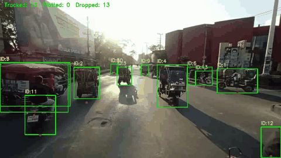
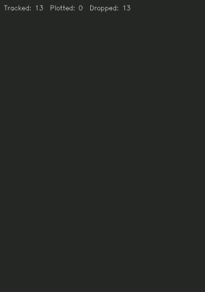
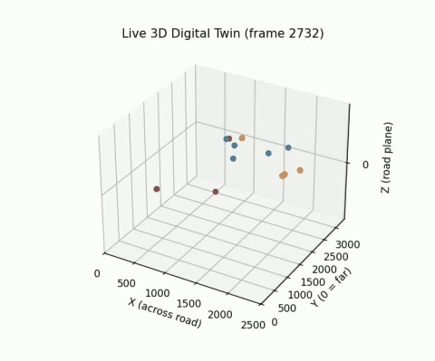

# URBAN DIGITAL TWIN PERCEPTION ENGINE

### TalkToMyTwin: a conversational traffic digital twin built from a single roadside camera

TalkToMyTwin turns ordinary traffic footage into a live, metric, bird's-eye model of the road. Every vehicle is detected, tracked, projected onto the ground plane, and logged with its position over time. On top of that log sit analytics and safety measures such as speed, lane usage, headway and time-to-collision. A conversational layer that explains what the twin sees is planned.

---

## Demo

One pass of `digital_twin_log_Generalized.py` over a clip produces three synchronized views plus a per-detection CSV log. The clips below are 10 seconds of the `weast` approach (frames 2730-3030), calibrated with the camera-model homography.

**Source tracking:** YOLO detections, persistent track IDs, and the estimated ground-contact point of each vehicle.



**Digital twin (2D bird's-eye):** each vehicle is a point on the road plane in meters, with heading arrows and proximity lines between nearby vehicles. Green points are near-field (high position confidence) and orange points are far-field.



**Digital twin (3D):** the same scene on a single ground plane, colored by vehicle class.



---

## Current Progress

| Stage | Status | Where |
| --- | --- | --- |
| Road segmentation (SegFormer, Cityscapes) | Done | `road_seg_Generalized.py` |
| Automatic calibration frame selection | Done | `best_frame_Generalized.py` |
| Automatic homography / IPM from fitted road edges | Done | `homo_IPM_Generalized.py` |
| Vehicle detection + multi-object tracking (YOLO11s + BoT-SORT) | Done | `digital_twin_log_Generalized.py` |
| Ground-point refinement, smoothing, jump rejection | Done | `digital_twin_log_Generalized.py` |
| Live 2D + 3D twin with video recording | Done | `digital_twin_log_Generalized.py` |
| Per-detection CSV logging | Done | `tracking_log.csv` |
| Kalman filter kinematics (position, velocity, acceleration) | Done | `kalman_Generalized.py`, `motion_Generalized.py` |
| Tracking quality evaluation | Done | `eval_Generalized.py` |
| Traffic EDA (lanes, speed, headway, Edie's fundamental diagram) | Done | `eda_Generalized.py` |
| Surrogate safety measures (TTC, MTTC, DRAC) | Done (offline) | `ttc_Generalized.py` |
| MOT-format export for TrackEval | Done | `trackeval_export_video_calb.py` |
| FPS check, depth/width scale correction from scene rulers | Done | `fps_check_video_calb.py`, `depth_calib_Generalized.py` |
| Speed ground truth by manual timing + error report | Done | `manual_timing_video_calb.py`, `speed_eval_video_calb.py` |
| Speed / acceleration sanity checks | Done | `sanity_checks_Generalized.py` |
| CVAT ground truth + HOTA/IDF1 scoring | Tooling done, labelling in progress | `make_label_clip_video_calb.py`, `run_trackeval_video_calb.py` |
| Real-time alert engine | Planned | |
| Multi-camera fusion (other intersection approaches) | Planned | |
| Conversational interface (LLM explains twin state) | Planned | |

---

## Pipeline

```text
Camera feed
    -> Road segmentation (SegFormer)          road_seg_Generalized.py
    -> Calibration frame + homography         best_frame_Generalized.py, homo_IPM_Generalized.py
    -> Detection + tracking (YOLO11s, BoT-SORT)
    -> Ground-point projection to road plane   digital_twin_log_Generalized.py
    -> 2D / 3D twin + tracking_log.csv
    -> Kalman kinematics                       kalman_Generalized.py, motion_Generalized.py
    -> Evaluation, EDA, safety measures        eval_Generalized.py, eda_Generalized.py, ttc_Generalized.py
```

**Calibration.** `best_frame_Generalized.py` scans the clip for the frame with the largest visible road area. `homo_IPM_Generalized.py` fits straight lines to the left and right road edges of that frame's mask, takes four corners from them, and maps them to a rectangle that assumes a 7 m road width at 120 px/m. The resulting matrix is saved to `homography.npy`.

**Twin.** Each tracked box is reduced to a ground-contact point, refined from the dark band under the vehicle. That point is projected through the homography and smoothed with an exponential moving average. Implausible single-frame jumps are rejected. Detections in the upper 35% of the calibrated region are flagged `low_conf` because homography error grows with distance.

---

## Results So Far

Measured on the 12.6 s `weast` clip (378 frames, 2,494 logged detections):

| Metric | Value |
| --- | --- |
| Frames with at least one detection | 378 / 378 (100%) |
| Detections kept in the twin (in bounds and stable) | 2,404 / 2,494 (96.4%) |
| Unique tracks | 90 (median length 11.5 frames) |
| Short tracks (< 5 frames, likely fragments) | 26 / 90 (28.9%) |
| Class mix | 1,498 car, 498 truck, 495 motorcycle, 3 bus |
| Near-field TTC warnings | 2 |
| Far-field TTC warnings | 1,381 |

The far-field TTC count shows the main open problem. Most of the scene lies in the low-confidence zone, where position noise produces false conflicts. Better depth calibration and ground-truth scoring are the next priorities.

---

## Repository Layout

```text
digital_twin_log_Generalized.py     main pipeline: tracking, twin views, CSV log, video output
road_seg_Generalized.py             SegFormer road mask
best_frame_Generalized.py           pick the calibration frame
homo_IPM_Generalized.py             compute homography.npy from the calibration frame
kalman_Generalized.py               constant-acceleration Kalman filter
motion_Generalized.py               per-track kinematics from the log
log_loader_Generalized.py           typed CSV loader shared by the analysis scripts
plausibility_Generalized.py         physical plausibility thresholds
eval_Generalized.py                 coverage, track-length and per-class evaluation
eda_Generalized.py                  lane, speed, headway and fundamental-diagram analysis
ttc_Generalized.py                  TTC / MTTC / DRAC conflict detection
trackeval_export_video_calb.py     export predictions in MOTChallenge format
scene_Generalized.py                shared calibration: fps, scale factors, homography paths
fps_check_video_calb.py            verify the clip frame rate with OpenCV and ffprobe
depth_calib_Generalized.py          fit width/depth scale from known lengths, reproject the log
manual_timing_video_calb.py        time vehicles between two markings for ground-truth speed
speed_eval_video_calb.py           compare pipeline speeds with manual timing
sanity_checks_Generalized.py        urban speed range and acceleration plausibility
make_label_clip_video_calb.py      cut a frame-exact clip for CVAT
run_trackeval_video_calb.py        score a CVAT MOT 1.1 export with TrackEval (HOTA, IDF1, MOTA)
stabilize_video_calb.py     map every frame of a handheld clip onto the calibration frame
ground_model_Generalized.py  camera-model homography: horizon from vehicle sizes, focal length from a ruler
run_sections_video_calb.py   run calibration, tracking and analysis for each ruler section of the Weast clip
```

---

## Getting Started

```bash
pip install ultralytics opencv-python torch transformers pandas matplotlib numpy
```

Place source clips in `dataset/`, which git ignores. The `yolo11s.pt` weights are not in the repo; Ultralytics downloads them automatically on first run. Then run:

```bash
python best_frame_Generalized.py          # writes calibration_frame.jpg
python homo_IPM_Generalized.py            # writes homography.npy
python digital_twin_log_Generalized.py    # live views, output_*.avi, tracking_log.csv
```

Controls in the live window: `space` pauses, `n` steps one frame while paused, and `q` or `Esc` quits.

The analysis scripts read `tracking_log.csv` and need no GPU:

```bash
python eval_Generalized.py
python eda_Generalized.py
python ttc_Generalized.py
python trackeval_export_video_calb.py
```

---

## Validation

The Weast clip is handheld, so a single homography only holds near its calibration frame. The edge-fitted homography also put the horizon at y = -1038 when vehicle sizes place it near y = 280, which squashed the far field. `run_sections_video_calb.py` splits the clip into ±150-frame sections around four cars with known wheelbases. For each section it picks a calibration frame, stabilizes the section, tracks once, fits the camera model with `ground_model_Generalized.py`, tracks again, and runs eval, EDA, TTC and sanity checks before and after. Results go to `sections/`.


`homography.npy` assumes a 7 m road width, and it takes the depth scale from the image aspect ratio, which has no metric meaning. `depth_calib_Generalized.py` corrects both axes using lengths you know in the scene. The corrected homography is `diag(sx, sy, 1) @ homography_raw.npy`, and both scale factors are stored in `calibration.json`.

1. Check the frame rate and store it:

```bash
python fps_check_video_calb.py --write
```

2. Calibrate the scale. Click two points, then label the pair in the terminal: `f 7.5` is a fit pair (a dash plus its gap, or a lane width) and `c 3.5` is a held-out check pair. `v hatchback` marks a vehicle's front and rear ground points, which are compared against class length priors. Look up the IRC:35 marking dimensions before you enter them. Use `a`/`d` and `j`/`l` to change frames.

```bash
python depth_calib_Generalized.py
python depth_calib_Generalized.py --solve --write
```

The error on the check pairs is your scale error. A strong error trend from far to near rows means one scale factor cannot fix the scene. `--write` also reprojects `tracking_log.csv` in place.

3. Get ground-truth speeds. Define lines A and B on two markings a known distance apart, click a vehicle, then press `1` and `2` on the frames where it crosses each line.

```bash
python manual_timing_video_calb.py
python speed_eval_video_calb.py
python sanity_checks_Generalized.py
```

4. Measure tracking accuracy. Cut a clip, label it in CVAT, and export it as MOT 1.1 into `annotations/`. Then run TrackEval:

```bash
python make_label_clip_video_calb.py --start 1 --frames 300
pip install git+https://github.com/JonathonLuiten/TrackEval.git
python run_trackeval_video_calb.py --frame-offset 0
```

---

## Tech Stack

Python, PyTorch, Ultralytics YOLO11, BoT-SORT, Hugging Face Transformers (SegFormer), OpenCV, NumPy, Pandas, Matplotlib.

---

## Roadmap

- Hand-annotate a ground-truth clip and report HOTA / MOTA / IDF1 with TrackEval
- Lane-aware, heading-gated conflict detection and a live alert stream
- Fuse the other intersection approach cameras (North, South, East, ...) into one twin
- Store twin state in a database and add a conversational query layer on top
