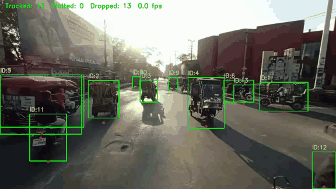
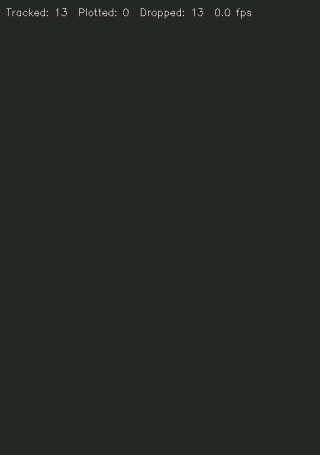
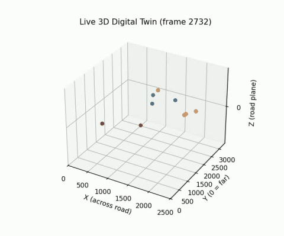

# URBAN DIGITAL TWIN PERCEPTION ENGINE

### A metric traffic digital twin with live safety alerts, built from a single ordinary camera

The engine turns traffic video into a live, metric, bird's-eye model of the road. Every vehicle is detected, tracked, placed on the ground plane in metres, and given a filtered speed. On top of that state it raises live safety alerts (near-miss conflicts, overspeeding and sudden acceleration), stores everything in a SQLite database, and supports offline traffic analysis.

It calibrates itself from the traffic: the horizon comes from how vehicle sizes shrink with distance, and the scale from one vehicle of known size. It works on uncalibrated, even handheld footage, and also accepts known camera specs for a fixed deployment.

---

## Final Output

Ten seconds of the `weast` approach (frames 2730-3030), processed live by `digital_twin_log_Generalized.py`. Full-quality videos and the alert list are in [`final_output_results/`](final_output_results).

**Tracking with live alerts.** Each vehicle has a persistent ID and a live speed. Vehicles in an alert get a coloured box and label: red for critical, orange for warning, magenta for sudden acceleration. The banner at the top right lists active alerts, such as `CONFLICT tracks 9-18 TTC 0.0 s`.



**Digital twin, 2D bird's-eye view.** Vehicles on the road plane in metres, with heading arrows. Alerted vehicles are ringed, and conflicting pairs are joined by a line. Green points are near field and orange points are far field.



**Digital twin, 3D view.** The same scene on the ground plane, coloured by vehicle class.



---

## What It Does

| Capability | How |
| --- | --- |
| Detection and tracking | YOLO11s and BoT-SORT, fp16 on the GPU, with detection pipelined in its own thread |
| Self-calibration | Horizon from vehicle box sizes, camera height from typical vehicle heights, focal length from one known wheelbase |
| Calibration from specs | Mounting height, tilt and focal length are enough; no estimation needed |
| Handheld footage | Road-plane stabilization maps every frame onto the calibration frame |
| Metric twin | Ground-contact point per vehicle, projected to metres, with guards against bad ground points and vehicles cut off by the frame edge |
| Speed and acceleration | Constant-acceleration Kalman filter with a backward smoothing pass; tracks are split at impossible jumps |
| Live alerts | Time-to-collision conflicts, overspeed (warning above the limit, critical above limit + 15 km/h) and sudden acceleration (+15 km/h within 2 s) |
| Storage | SQLite database of runs, detections, kinematics and alerts, plus a CSV log |
| Offline analysis | Lanes, speed distributions, headway, fundamental diagram, TTC / MTTC / DRAC, plausibility checks |

---

## Results

Measured on the reliable calibrated section (frames 2730-3030) unless stated otherwise.

| Metric | Value |
| --- | --- |
| Speed error against 3 timed reference cars (known wheelbase over measured frames) | 14% mean, about 86% accurate |
| Tracks with plausible urban speeds (10-60 km/h) | 48% (median speed 9.3 km/h in congested traffic) |
| Implausible accelerations (above 4 m/s²) | 2.9% of readings |
| Persistent conflicts, offline (10 s) | 13 vehicle pairs |
| Live alerts raised (10 s) | 5 conflicts, 1 of them critical |
| Conflict alerts that look plausible on video (2 sections) | About 6 of 10 |
| Processing speed on an RTX 2050 laptop GPU | 8.5 frames/s by default, 17 frames/s with `--fast` |

### Against the standard open-source method

The standard method follows the Roboflow Supervision speed-estimation recipe: a 4-point road homography, ByteTrack, and speed from a 1-second window. Both systems used the same detector, the same frames and the same single known car for scale.

| Section | Speed error, standard method | Speed error, this engine | Plausible speeds, standard method | Plausible speeds, this engine |
| --- | --- | --- | --- | --- |
| 720 | +15% | -12% | 31.6% | 39.1% |
| 2880 | -27% | +16% | 12.5% | 48.3% |
| 3300 | n/a | n/a | 21.4% | 25.0% |
| 4620 | +96% | +13% | 26.7% | 55.0% |
| **Mean** | **46%** | **14%** | | |

Tracking quality is about the same for both methods (about 50% short tracks in this crowded scene). The gain comes from the geometry and speed estimation, not from the tracker.

### Ablation

Each row adds one component and reports its effect on the same footage.

| Component | Without it | With it |
| --- | --- | --- |
| Camera-model calibration, replacing the road-edge homography | Horizon at y = -1038, road depth modelled as 2.5 m, median speed 3.5 km/h, 0% of tracks in 10-60 km/h, 1,550 far-field TTC events | Horizon at y = 277 (two vehicle-size estimates agree within 11 px), 30 m depth, median 9.4 km/h, 46% of tracks in range, 264 far-field events |
| Per-section stabilization, replacing a single reference for the clip | 2% of frames matched to the reference and a 4,840-frame drifting chain | 41-86% of frames matched directly, longest chain 19-126 frames |
| Retuned Kalman filter with backward smoothing | Implausible accelerations 45%, speed error on timed cars 23% | Implausible accelerations 5%, speed error 11% |
| Track splitting at impossible jumps | Timed car read 31.8 km/h against 14.0 km/h true | 10.6 km/h, before smoothing |
| Ground-point guard and frame-edge gate | False critical overspeed alert (46 km/h), implausible accelerations 5% | False alert removed, implausible accelerations 2.9%. Speed error rises from 11% to 14% because edge-touching frames are dropped |
| Gated, persistent, footprint-based TTC, replacing naive point TTC per frame | 266 events in 10 s | 10 persistent conflicts in 10 s |
| fp16, background video writing, pipelined detection | About 6 frames/s (estimated from component timings) | 8.5 frames/s, or 17.1 frames/s with `--fast` |

### Limitations

- Speed accuracy rests on 3 reference cars, each also used to calibrate its own section.
- Vehicles side by side in dense traffic can be flagged as conflicts. These make up most of the false alarms seen on video.
- The footage contains no real overspeeding (traffic moves at about 5-25 km/h), so overspeed alerts are shown working but not validated.
- Two of the four calibrated sections failed a held-out cross-check (+22% and -16%) and are treated as lower confidence.

---

## How It Compares With Existing Systems

| System | Type | Camera and calibration | Safety metrics | Live alerts | Openness |
| --- | --- | --- | --- | --- | --- |
| [Miovision Scout](https://miovision.com/blog/the-miovision-scout-vs-the-competition/) | Portable traffic data collection unit | Dedicated pole-mounted device. The camera view is checked by Miovision on site for conflict studies | Counts and conflict analysis | Data collection, post-processed | Commercial hardware and subscription |
| [GoodVision Video Insights](https://goodvisionlive.com/goodvision-video-insights/) | Cloud video analytics | Upload footage from any camera, including smartphones and drones | Near-miss detection with post-encroachment time (PET) | No; offline processing in the cloud | Commercial SaaS |
| [Derq](https://en.derq.com/faq) | Intersection safety analytics | Installed or existing intersection sensors | Near misses by PET, TTC, gap time and speed; violations | Yes, real time at deployed intersections | Commercial |
| [Transoft TrafxSAFE](https://www.transoftsolutions.com/blog/what-is-surrogate-road-safety-and-why-we-use-it/) | Surrogate safety studies | Video from almost any camera, typically 30-60 hours per study | PET, TTC | No; study-based | Commercial service |
| [NVIDIA Metropolis / DeepStream](https://docs.nvidia.com/vss/3.0.0/smartcity-docs/3.0.0/Calibration.html) | Developer platform | Manual calibration that matches image points to map coordinates | Built by the developer | Possible, built by the developer | SDK |
| [Roboflow Supervision](https://blog.roboflow.com/estimate-speed-computer-vision) | Open-source tutorial and library | 4 manually chosen road points with known real dimensions | Speed only | Display only | Open source |
| **This engine** | Open-source pipeline | Self-calibrating from vehicle sizes and one known car, or from camera specs. Works on handheld video | TTC, MTTC, DRAC, overspeed, sudden acceleration | Yes, live in the tracker | Open source, runs on a laptop GPU |

**What differs here:**

- **No surveyed calibration needed.** Commercial and SDK systems rely on a mounted camera with a manual or on-site calibration. This engine estimates the horizon from the traffic itself and needs only one known object, or the camera's specs.
- **Works on unstable footage.** Section-wise stabilization handles handheld clips that a single fixed homography cannot.
- **Live, gated safety alerts on commodity hardware.** Conflicts are filtered by heading, lane, vehicle footprint and persistence, which turns 266 naive events into about 10 conflicts. Speeding rules run alongside, at 8-17 frames/s on a laptop GPU.
- **Open and inspectable.** Every alert and kinematic state is in a plain SQLite database.

The commercial systems remain stronger on fixed-mount accuracy, validated certification, multi-camera coverage and round-the-clock reliability.

---

## Pipeline

```text
Video or camera feed
    -> Calibration frame + road mask                best_frame_Generalized.py, road_seg_Generalized.py
    -> Ground-plane model                           ground_model_Generalized.py
         (from vehicle sizes + one known car, or from camera height / tilt / focal length)
    -> Detection + tracking (YOLO11s, BoT-SORT)     digital_twin_log_Generalized.py
    -> Ground point -> metres -> live Kalman        digital_twin_log_Generalized.py, alerts_Generalized.py
    -> Live alerts: conflict / overspeed / sudden   alerts_Generalized.py
    -> 2D / 3D twin, videos, tracking_log.csv       digital_twin_log_Generalized.py
    -> SQLite twin state                            twin_db_Generalized.py
    -> Offline analysis                             eda_Generalized.py, ttc_Generalized.py, eval_Generalized.py,
                                                    sanity_checks_Generalized.py
```

---

## Database

Every tracker run writes `twin_state.db` (SQLite). A new run replaces the previous one; `--keep-db` appends instead.

```text
runs (1) ──┬──< detections   one row per vehicle per frame (raw tracking output)
           ├──< kinematics   one row per vehicle per frame (filtered position, velocity, speed)
           └──< alerts       one row per alert
```

| Table | Key columns |
| --- | --- |
| `runs` | `run_id`, created time, video, frame range, fps, full calibration as JSON |
| `detections` | `run_id`, `frame_idx`, `track_id`, class, confidence, box `x1 y1 x2 y2`, ground point `gx gy`, twin position `X Y`, quality flags |
| `kinematics` | `run_id`, `frame_idx`, `track_id`, position `x_m y_m`, velocity `vx vy`, acceleration `ax ay`, `speed_kmh` |
| `alerts` | `run_id`, `alert_id`, `type` (conflict / overspeed / sudden_acceleration), `severity` (warning / critical), frames, tracks, `far_field`, speed, rise, TTC, gap, message |

Indexes on `(run_id, frame_idx)` and `(run_id, track_id)` keep per-frame and per-vehicle queries fast. The database uses WAL mode so it can be read while the tracker writes, and rows are written in batches (about 1-2 ms per frame).

```bash
python twin_db_Generalized.py --summary
```

---

## Getting Started

```bash
pip install ultralytics opencv-python torch transformers pandas matplotlib numpy pyyaml
```

The `yolo11s.pt` weights download automatically on first use.

**1. Calibrate.** For a deployed camera with known specs, run this in the camera's working folder:

```bash
python ground_model_Generalized.py --camera-height 6.0 --pitch 12 --focal 1100 --image-size 1920 1080 --write
```

Without specs, calibrate from the footage:

```bash
python best_frame_Generalized.py --video path/to/clip.mp4 --start 0 --end 600 --no-show
python homo_IPM_Generalized.py --no-show
python digital_twin_log_Generalized.py --no-show
python depth_calib_Generalized.py
python ground_model_Generalized.py --write
```

Steps 3 to 5 are: a first tracking pass for vehicle sizes, clicking one known length such as a car's wheelbase, then fitting the camera model.

**2. Run the twin with live alerts.** The tracker reads the video and frame range from `calibration.json`:

```bash
python digital_twin_log_Generalized.py
python digital_twin_log_Generalized.py --fast --plot3d-every 0
```

| Option | Effect |
| --- | --- |
| `--fast` | BoT-SORT without camera-motion compensation, about twice as fast |
| `--plot3d-every N` | Draw the 3D view every N frames; `0` turns it off |
| `--conf 0.25` | Faster detection, but weak boxes are dropped |
| `--no-show` | No windows, for batch runs |
| `--keep-db` | Add this run to the database instead of replacing it |

Live window controls: `space` pauses, `n` steps one frame, `q` or `Esc` quits.

Alert thresholds such as the speed limit are constants at the top of `alerts_Generalized.py`.

**3. Analyse offline.** These read `tracking_log.csv` and need no GPU:

```bash
python sanity_checks_Generalized.py
python eda_Generalized.py
python ttc_Generalized.py
python eval_Generalized.py
```

---

## Repository Layout

```text
digital_twin_log_Generalized.py   tracker: detection, twin views, live alerts, CSV + database, videos
alerts_Generalized.py             live alert engine: conflicts, overspeed, sudden acceleration
twin_db_Generalized.py            SQLite storage for runs, detections, kinematics and alerts
ground_model_Generalized.py       ground-plane camera model from vehicle sizes or camera specs
best_frame_Generalized.py         pick the calibration frame and record the frame range
road_seg_Generalized.py           SegFormer road mask
homo_IPM_Generalized.py           road-edge homography (road mask for stabilization)
depth_calib_Generalized.py        click known lengths; log reprojection helper
scene_Generalized.py              shared calibration, stabilization transforms and canvas bounds
kalman_Generalized.py             constant-acceleration Kalman filter with backward smoothing
motion_Generalized.py             per-track kinematics, split at impossible jumps
log_loader_Generalized.py         typed CSV loader
plausibility_Generalized.py       physical plausibility thresholds
ttc_Generalized.py                gated, persistent TTC / MTTC / DRAC conflicts
eda_Generalized.py                lanes, speed, headway, fundamental diagram
eval_Generalized.py               coverage, track length, per-class evaluation
sanity_checks_Generalized.py      urban speed range and acceleration plausibility
final_output_results/             final demo GIFs and alert list
```

---

## Tech Stack

Python, PyTorch, Ultralytics YOLO11, BoT-SORT, Hugging Face Transformers (SegFormer), OpenCV, NumPy, Pandas, SQLite, Matplotlib.

---

## Roadmap

- Tighter lane gating for side-by-side vehicles in dense traffic
- Hand-labelled ground truth for HOTA / IDF1 tracking scores
- TensorRT export for faster detection
- Fuse the other intersection approaches into one twin
- Conversational query layer over the twin database
